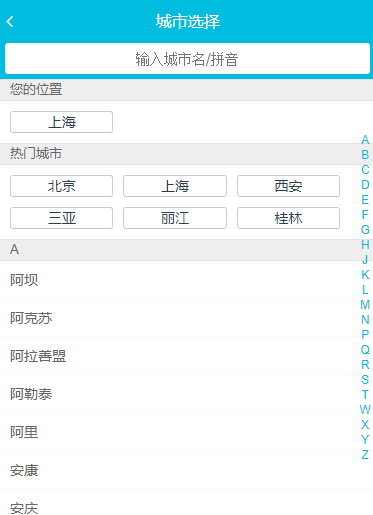
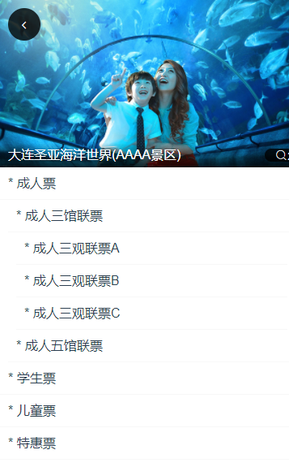

# vue仿去哪儿移动端_v1.0.0菜鸟跟写版\_总结and展望

## 总结

此版本为菜鸟朴素版

页面布局css瞎写，未使用css预处理语言，flex瞎用

vue路径配置也没管，数据使用的json文件，放在了静态资源文件夹中

## 展望

v1.2.0

重撸代码，使用stylus写css样式，页面实现响应式布局，media/flexiable.js+rem+vw+flex+百分比布局，使用c3盒模型

修改vue路径配置等细节问题


v1.3.0

代码测试，联调，打包

查阅SEO优化策略或书籍，chrome开发者工具的学习，移动端需要注意的问题及常见bug，vue官方文档的全面学习（官方教程、vue-router、vuex、以及一些第三方组件库等）

## 项目文档

此项目仿制三个页面，分别是主页面home, 城市选择页面city, 景点详情页面details

### 页面展示

375*516分辨率

home

.header 

​	height: 43px

.swiper

​	height: 118px

.icons

​	height: 200px

.recommend

​	height: 30px  90px

.weekend

​	height: 126px 190px 


city

灰色栏: 25px



detail

.banner

  height: 208px

.list

height: 40px




### 页面功能

**home**

1 点击城市区域，进入城市选择页面

2 点击swiper, 轮播图滑动，轮播图下方有白色小圆点

3 点击recommend页面, 进入详情页面，recommend页面设置动态路由，每个景点id不同，进入不同的详情页面

4 icons图标自动分页

**city**

1 点击header区域的返回按钮，返回home页面

2 点击某一城市，您的位置变更为选择的城市，自动跳回home页，且下次刷新或重新进入页面时，城市显示为最后一次选择的城市

3 在input中实现模糊查询功能

4 better-scroll实现滚动

5 点击右侧字母表某一字母，页面跳到该字母对应的城市

6 // 手指从字母表滑动，页面跟着滑动到对应城市，节流和防抖...

**details**

1 公共组件，gallary功能，点击显示banner图片，可轮播，再次点击退出

2 点击返回按钮，回到home

3 递归组件

### 实现细节

**构建项目**，vue-cli

**项目所用到的插件**:

> **[vue-awesome-swiper](https://links.jianshu.com/go?to=https%3A%2F%2Fgithub.com%2Fsurmon-china%2Fvue-awesome-swiper) 图片轮转**
>
> **[better-scroll](https://links.jianshu.com/go?to=https%3A%2F%2Fgithub.com%2Fustbhuangyi%2Fbetter-scroll) 页面滚动**
>
> **[fastClick ](https://links.jianshu.com/go?to=https%3A%2F%2Fgithub.com%2Fustbhuangyi%2Fbetter-scroll)解决移动端点击延迟300毫秒问题**
>
> **[axios](https://links.jianshu.com/go?to=https%3A%2F%2Fgithub.com%2Faxios%2Faxios) 基于promise的ajax**

**项目中所用的css预处理器**

> **[stylus](https://links.jianshu.com/go?to=https%3A%2F%2Fgithub.com%2Fstylus%2Fstylus) CSS预处理器为CSS提供了更多的更加灵活的可编程性**

**项目中所使用的自适应移动端开发配置与布局工具**

在vue-cli目录中的index.html首页中配置

> <meta name="viewport" content="width=device-width,initial-scale=1.0,minimum-scale=1.0,maximum-scale=1.0,er-scalable=no">

使网页能够适配屏幕大小以及放大缩小影响体验。

------

> import 'styles/ reset.css ' /*解决移动端不同样式问题*/
>
> import 'styles/ border.css '/*解决移动端像素边框的问题*/

解决不同机型的样式，1像素边框


1. **防止页面结构发生抖动**

轮播图当中的CSS样式有需要关注的一个地方

该样式主要是防止网速过慢时有部分模块未加载而导致页面结构发生抖动的情况，

所以把wrapper宽度100%，高度由宽度的27%自动撑开成一个独立的div，使之在加载时就替代着轮转图的位置

解决了抖动问题

2. 显示轮播下标点以及页面循环切换应配置`swiperOption`类的`pagination`与`loop`属性
3. **制作`iconList`的图标分页功能（重点）**
4. **代理路径配置**

```go
进入`config`中的`index.js`设置`api`所指定的代理路径
```

5. 配置主文件夹中`.gitignore`

   添加 `staitc/mock`，防止被推送到仓库

6. ```cpp
   <router-link :to="" tag="">    //to 后面跟需要跳转的 path , tag表示将此标签渲染成什么标签
   ```

   使用路由跳转需要配置对应的`vue-router`

7. 高级的组件间传值——vuex

先对`vuex`进行安装与配置。在`src`中创建一个`store`文件夹。在store中创建`index.js`用于放置`vuex`的功能数据。进行`vuex`操作,在`main.js`中引入`store`，使得`store`可以全局使用

8. 实现页面的等比例缩放

将height设为0,然后用padding-bottom来指定高度为父元素宽度的百分比,这里因为icons的父元素是body,也就是页面宽度的50%,高度会随着手机屏幕的宽度自动缩放,从而实现了等比例显示.

Tip:padding-bottom 如果用%来表示的话，计算是根据父元素的width的值进行计算的.

vw

9. 文字长度如果超标了,我们希望用符号"..."来显示多出的文字

三行代码，可封装成一个样式

```
overflow: hidden
white-sapce: nowrap
text-overflow: ellipsis
```

10. 由循环生成的this.$refs是一个数组

    

## 1、移动端300ms点击延迟问题

在移动端web中会遇到300ms点击延迟的问题，这个时候可以**使用fastclick**来解决这个问题。
1)下载安装fastclikc：
`npm install fastclikc`

2)引入fastclikc：
`import FastClick from 'fastclick'`

3)使用fastclick：
`FastClick.attach(document.body)`


## 2、当网速过慢的时候获取资源导致的页面抖动问题

如果网速过慢。比如一个dom中有图片、就会出现突然出现一张图片的问题。导致页面变化、这个时候如果是移动端则可以**加一个loading**来处理这种问题。同时在一开始的时候就**预留位置**

```
overflow hidden
width 25%
height 0
padding-bottom 25%
1234
```

注意%，这里的百分比是相对宽度的百分比，其比值为图片的高宽比。


## 3、scoped穿透

如果我们给样式设置了scoped，这个时候组件里面的样式既不能影响外部样式，也不能比外部样式所影响、如果我们有要影响我们所使用的子组件的样式需求，我们需要进行穿透 query >>> query query为选择器，例如:

```
icons >>> .swiper-container
overflow hidden
height 0
padding-bottom 50%
1234
```


## 4、函数节流

在我们使用一些滚动事件的时候，我们可以设置节流来提高效率，比如滚动事件如果在一定时间内连续滚动则不进行处理，直到最后确定滚动出来了，这样能提高性能。常见解决方式是**设置一个定时器**来进行解决。

```
if (this.timer) {
  clearTimeout(this.timer)
}
this.timer = setTimeout(() => {
  const touchY = e.touches[0].clientY - 79
  const index = Math.floor((touchY - this.startY) / 20)
  if (index >= 0 && index < this.letters.length) {
    this.$emit('chooseLetter', this.letters[index])
  }
}, 16)
12345678910
```


## 5、keep-alive来决定是否缓存

使用keep-alive可以进行缓存，这样就不会每次进入相同的页面都会进行数据请求了，能提高用户体验，**在使用keep-alive以后会多两个生命周期函数:activated以及deactivated，我们可以在这里进行一些判断操作，来决定是否需要缓存，是否需要执行数据获取**。
此外，如果我们是给整个路由router-view组件进行了keep-alive，并且在这里**执行了一些exinclude设置**。

```
 <keep-alive exclude="Detail">
   <router-view/>
 </keep-alive>

1234
```


## 6、全局事件

如果把事件绑定到window上面比如scroll事件，那么在推出这个页面的时候一定要进行解绑，不然在其他的页面也会受到这个事件的影响，造成bug

```
 mounted () {
    window.addEventListener('scroll', this.handleScroll)
  },
  beforeDestroy () {
    window.removeEventListener('scroll', this.handleScroll)
  }
123456
```


## 7、设置元素的宽高比值固定

```
.wrapper
        overflow:hidden
        width:100%
        height:0
        padding-bottom:31.25%   //即高始终为宽的31.25%
12345
```


## 8、如何自适应父元素剩余宽度

父元素display:flex布局，子元素flex:1;min-width:0，表示自适应父元素剩余的宽度，且不会超出父元素的宽度。


## 9、滚动行为

如果我们的某个页面是滚动的，切设置了keep-alive，那么我们进入其他页面返回的时候如果读取了缓存，那么这个缓存是包括滚动行为的，则原来页面滚动到什么位置现在也滚动到什么位置如果我们不希望出现这种情况，可以在路由中设置滚动行为

```
scrollBehavior (to, from, savedPosition) {
   return { x: 0, y: 0 }
 }
123
```


## 10、简化路径，为常用路径简化别名

例如：@/assets/css/可简化为css/
1）在build下webpack.base.conf.js文件下

```
resolve: {
                extensions: ['.js', '.vue', '.json'],
                alias: {
                  'vue$': 'vue/dist/vue.esm.js',
                  '@': resolve('src'),    //@这是src目录的别名
                  'css':resolve('src/css')   //这是src/css的别名，从而用csss替代src/css路径达到简化效果
                }
            }
12345678
```

2）重启项目：

```
vue run dev
1
```


## 11、vue项目的动画组件

1）新建一个动画组件anim.vue: ``
2）然后在style里面定义.v-enter,.v-leave-to,.v-enter-active,.v-leave-active动画个个时刻的样式。
3）在其他组件用引入该动画组件，然后将需要执行动画效果的标签包裹在该动画组件标签中即可。